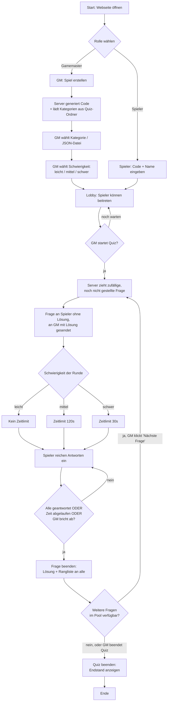
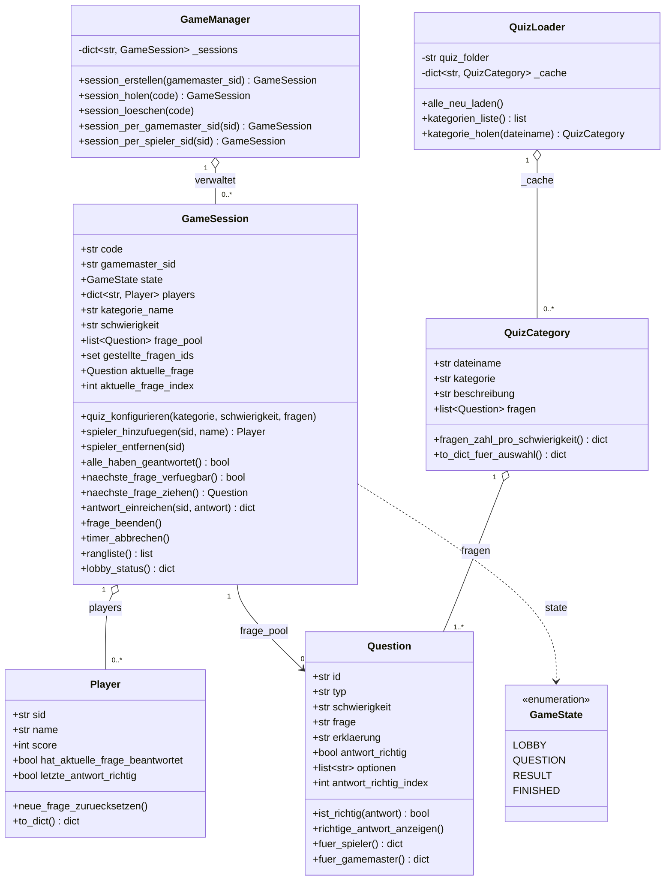

# Quiz-WebApp (Gamemaster &amp; Spieler)

Eine Echtzeit-Quiz-WebApp im Stil von Kahoot: Ein **Gamemaster** erstellt eine
Spielrunde, wählt eine **Kategorie** (= eine JSON-Datei aus dem `Quiz/`-Ordner)
und eine **Schwierigkeit** (leicht / mittel / schwer). **Spieler** treten über
einen **Beitritts-Code** bei und beantworten Fragen, die der Gamemaster
steuert. Die komplette Logik (Zustände, Punkte, Zufallsauswahl der Fragen,
Zeitlimits) läuft in **Python** auf dem Server; das Frontend ist bewusst
einfach gehalten (Funktionalität vor Schönheit).

## Inhaltsverzeichnis

1. [Features](#features)
2. [Projektstruktur](#projektstruktur)
3. [Installation &amp; Start](#installation--start)
4. [Eigene Quiz-Kategorien erstellen](#eigene-quiz-kategorien-erstellen)
5. [Gamemaster-/Spieler-Prinzip](#gamemaster--spieler-prinzip)
6. [Schwierigkeitsgrade &amp; Zeitlimits](#schwierigkeitsgrade--zeitlimits)
7. [Ablaufdiagramm](#ablaufdiagramm)
8. [Klassendiagramm](#klassendiagramm)
9. [Socket.IO-Event-Referenz](#socketio-event-referenz)
10. [Bekannte Einschränkungen / mögliche Erweiterungen](#bekannte-einschränkungen--mögliche-erweiterungen)

---

## Features

- **Eine JSON-Datei = eine Kategorie.** Alle `.json`-Dateien im `Quiz/`-Ordner
  werden automatisch beim Erstellen einer neuen Spielrunde eingelesen.
- **Zwei Fragetypen:** `boolean` (Wahr/Falsch) und `multiple_choice` (4 Antwortmöglichkeiten).
- **Drei Schwierigkeitsgrade pro Kategorie:** leicht (kein Zeitlimit), mittel
  (120 Sekunden), schwer (30 Sekunden). Die Zeitlimits werden zentral in
  `config.py` festgelegt, nicht in der JSON-Datei.
- **Zufällige Fragenauswahl** ohne Wiederholung innerhalb einer Runde.
- **Gamemaster/Spieler-Trennung:** Nur der Gamemaster wählt Kategorie,
  Schwierigkeit, startet/beendet Fragen und das gesamte Quiz. Spieler können
  nur beitreten und antworten.
- **Beitritt per Code:** Ein zufällig generierter 5-stelliger Code pro Runde.
- **Echtzeit-Synchronisierung** über WebSockets (Flask-SocketIO) – alle sehen
  Lobby, Fragen und Rangliste live, ohne die Seite neu zu laden.
- **Validierung der JSON-Dateien:** Fehlerhafte Kategorie-Dateien werden beim
  Laden übersprungen (mit Warnung in der Server-Konsole) statt den Server
  zum Absturz zu bringen.
- **Serverseitige Auswertung:** Punkte, Korrektheit und Zeitlimits werden
  ausschließlich auf dem Server geprüft - Clients können nicht schummeln,
  da sie die Lösung nie an den Browser geschickt bekommen (außer dem
  Gamemaster).

---

## Projektstruktur

```
quiz-app/
├── app.py                  # Flask + Socket.IO Server: Routen + alle Events
├── game_manager.py         # Verwaltet alle laufenden GameSession-Objekte
├── models.py                # Question, Player, GameSession, GameState
├── quiz_loader.py           # Liest & validiert die JSON-Kategorien
├── config.py                 # Zentrale Konstanten (Zeitlimits, Pfade, ...)
├── requirements.txt
├── README.md
├── Quiz/
│   └── _template.json       # TEMPLATE für neue Kategorien (keine echten Fragen)
├── templates/
│   ├── index.html            # Startseite: Rollenauswahl
│   ├── gamemaster.html        # Steuerzentrale für den Gamemaster
│   └── player.html            # Beitritt + Spielansicht für Spieler
└── static/
    ├── css/style.css
    └── js/
        ├── gamemaster.js
        └── player.js
```

**Wichtig:** Dateien, die mit `_` beginnen (wie `_template.json`), werden vom
`QuizLoader` absichtlich **nicht** als Kategorie geladen. So kann das Template
dauerhaft im `Quiz/`-Ordner liegen bleiben, ohne als Auswahlmöglichkeit
aufzutauchen.

---

## Installation &amp; Start

Voraussetzung: Python 3.9+

```bash
cd quiz-app
pip install -r requirements.txt

python3 app.py
```

Die App läuft danach auf `http://localhost:5000`:

- Gamemaster öffnet: `http://localhost:5000/gamemaster`
- Spieler öffnen: `http://localhost:5000/player`

Mehrere Spieler können vom selben oder von verschiedenen Geräten im selben
Netzwerk beitreten (Server läuft auf `0.0.0.0`, also auch über die lokale
IP-Adresse des Rechners erreichbar, z.B. `http://192.168.x.x:5000/player`).

---

## Eigene Quiz-Kategorien erstellen

1. Kopiere `Quiz/_template.json` und benenne die Kopie nach deiner Kategorie,
   z.B. `Quiz/geografie.json`. Der Dateiname darf **nicht** mit `_` beginnen,
   sonst wird die Datei ignoriert.
2. Fülle die Felder `kategorie` und `beschreibung` aus.
3. Trage in `fragen` beliebig viele Fragen ein. Pro Frage:

   | Feld                     | Pflicht für          | Beschreibung                                              |
   |--------------------------|-----------------------|-------------------------------------------------------------|
   | `id`                     | alle                  | Eindeutig innerhalb der Datei                               |
   | `typ`                    | alle                  | `"boolean"` oder `"multiple_choice"`                        |
   | `schwierigkeit`          | alle                  | `"leicht"`, `"mittel"` oder `"schwer"`                       |
   | `frage`                  | alle                  | Fragetext                                                   |
   | `antwort_richtig`        | nur `boolean`         | `true` oder `false`                                          |
   | `optionen`               | nur `multiple_choice` | Liste mit **genau 4** Strings                                |
   | `antwort_richtig_index`  | nur `multiple_choice` | Index der richtigen Option (`0`-`3`)                          |
   | `erklaerung`             | optional              | Wird nach der Antwort angezeigt, darf `null` sein            |

4. Server neu starten **oder** einfach eine neue Spielrunde erstellen - die
   Kategorien werden bei jedem `gm_session_erstellen`-Event neu eingelesen,
   ein Neustart ist also nicht zwingend nötig.

Eine Kategorie sollte für ein sinnvolles Spielerlebnis Fragen in **allen drei**
Schwierigkeitsgraden enthalten, da die Schwierigkeit vor Spielstart einmalig
für die ganze Runde gewählt wird und nur Fragen dieser Schwierigkeit gezogen
werden.

---

## Gamemaster-/Spieler-Prinzip

- **Gamemaster** (genau eine Person pro Runde):
  - erstellt die Session (`gm_session_erstellen`) → erhält Code
  - wählt Kategorie + Schwierigkeit (`gm_quiz_konfigurieren`)
  - startet das Quiz, sobald mindestens ein Spieler beigetreten ist (`gm_quiz_starten`)
  - sieht bei jeder Frage sofort die **Lösung** (Spieler sehen sie nicht)
  - beendet Fragen manuell oder lässt sie automatisch per Zeitlimit enden
  - steuert die nächste Frage (`gm_naechste_frage`) oder beendet das Quiz (`gm_quiz_beenden`)
  - Trennt der Gamemaster die Verbindung, wird die ganze Runde beendet
    (alle Spieler werden informiert).

- **Spieler** (beliebig viele pro Runde):
  - treten nur während der Lobby-Phase bei (`player_beitreten`, Code + Name)
  - sehen Fragen **ohne** Lösung
  - reichen genau eine Antwort pro Frage ein (`player_antwort_einreichen`)
  - bekommen sofort eine private Rückmeldung, ob ihre Antwort richtig war
  - sehen nach jeder Frage die Musterlösung + die aktuelle Rangliste

Diese Trennung wird serverseitig erzwungen: Jedes `gm_*`-Event prüft, ob die
anfragende Socket-ID (`sid`) tatsächlich der gespeicherte `gamemaster_sid` der
jeweiligen Session ist (`_ist_gamemaster()` in `app.py`). Spieler können also
keine Gamemaster-Aktionen auslösen, selbst wenn sie die Events manuell senden
würden.

---

## Schwierigkeitsgrade &amp; Zeitlimits

| Schwierigkeit | Zeitlimit pro Frage | Wer beendet die Frage?                          |
|---------------|----------------------|---------------------------------------------------|
| `leicht`      | kein Limit            | Nur der Gamemaster manuell                          |
| `mittel`      | 120 Sekunden           | Automatisch nach Ablauf, oder alle haben geantwortet, oder GM bricht ab |
| `schwer`      | 30 Sekunden            | Automatisch nach Ablauf, oder alle haben geantwortet, oder GM bricht ab |

Die Werte stehen zentral in `config.py` (`TIME_LIMITS`) und lassen sich dort
anpassen, ohne den restlichen Code zu berühren.

---

## Ablaufdiagramm



---

## Klassendiagramm



---

## Socket.IO-Event-Referenz

### Gamemaster → Server

| Event                     | Payload                                        | Wirkung                                                        |
|---------------------------|--------------------------------------------------|-------------------------------------------------------------------|
| `gm_session_erstellen`    | `{}`                                              | Neue Session + Code erstellen, Kategorienliste laden               |
| `gm_quiz_konfigurieren`   | `{code, dateiname, schwierigkeit}`                | Kategorie + Schwierigkeit für die Runde festlegen                  |
| `gm_quiz_starten`         | `{code}`                                          | Erste Frage ziehen und an alle senden                              |
| `gm_naechste_frage`       | `{code}`                                          | Nächste zufällige Frage ziehen und senden                          |
| `gm_frage_beenden`        | `{code}`                                          | Aktuelle Frage manuell beenden (Lösung anzeigen)                   |
| `gm_quiz_beenden`         | `{code}`                                          | Runde beenden, Endstand an alle senden                             |

### Spieler → Server

| Event                          | Payload                  | Wirkung                                            |
|----------------------------------|---------------------------|-------------------------------------------------------|
| `player_beitreten`             | `{code, name}`            | Spieler tritt einer Lobby bei                          |
| `player_antwort_einreichen`    | `{code, antwort}`         | Antwort einreichen (bool oder Options-Index)            |

### Server → Clients

| Event                  | Empfänger                  | Inhalt                                                      |
|-------------------------|------------------------------|----------------------------------------------------------------|
| `session_erstellt`     | Gamemaster                  | `code`, `kategorien` (Liste verfügbarer JSON-Dateien)            |
| `quiz_konfiguriert`    | gesamter Raum                | gewählte Kategorie/Schwierigkeit + Anzahl verfügbarer Fragen      |
| `lobby_update`         | gesamter Raum                | aktuelle Spielerliste + Punktestand                              |
| `frage_gestartet`      | Spieler                      | Frage **ohne** Lösung + Zeitlimit                                |
| `frage_gestartet_gm`   | Gamemaster                   | Frage **mit** Lösung                                              |
| `antwort_bestaetigt`   | der einreichende Spieler     | ob die eigene Antwort richtig war                                 |
| `antwort_eingegangen`  | Gamemaster                   | wie viele Spieler bereits geantwortet haben                       |
| `frage_beendet`        | gesamter Raum                | Lösung, Erklärung, aktuelle Rangliste                              |
| `keine_weiteren_fragen`| Gamemaster                   | Hinweis, dass der Fragenpool erschöpft ist                         |
| `quiz_beendet`         | gesamter Raum                | finale Rangliste                                                   |
| `gamemaster_getrennt`  | gesamter Raum                | der Gamemaster hat die Verbindung verloren, Runde wurde beendet    |
| `fehler`               | nur der auslösende Client    | Fehlermeldung (z.B. falscher Code, doppelter Name, ...)            |

---

## Bekannte Einschränkungen / mögliche Erweiterungen

- Spieler können nur **während der Lobby-Phase** beitreten (kein Beitritt
  während einer laufenden Runde) - das ist eine bewusste Design-Entscheidung
  für faire Punktzahlen.
- Es gibt **keine Datenbank** - alle Sessions leben nur im Arbeitsspeicher des
  Server-Prozesses. Ein Neustart des Servers beendet alle laufenden Runden.
- Die Punktevergabe ist aktuell flach (richtige Antwort = fester Punktwert in
  `config.POINTS_PER_CORRECT_ANSWER`), ohne Zeitbonus. Das lässt sich in
  `models.GameSession.antwort_einreichen()` leicht erweitern.
- Für den produktiven Einsatz sollte `config.SECRET_KEY` geändert und der
  Server statt mit dem Flask-Entwicklungsserver z.B. mit `eventlet` oder
  `gunicorn` + `eventlet`-Worker betrieben werden.
